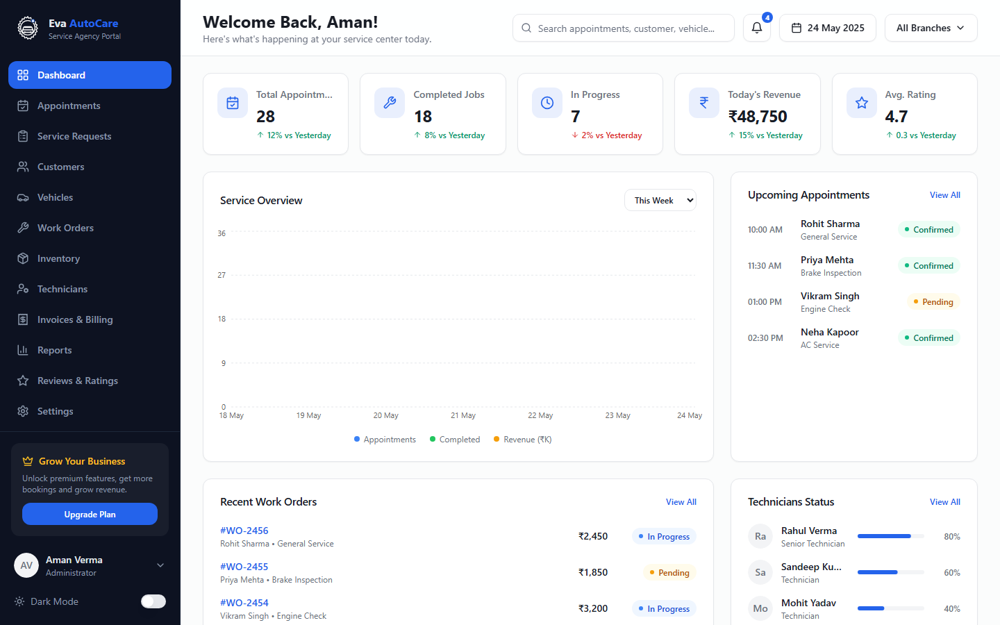

# Eva AutoCare

A free, open-source React auto-service admin dashboard — appointments, service requests, customers, vehicles, work orders, technicians, inventory, invoicing, reports and reviews, plus a fully-tabbed settings area.



**[Live Preview](https://eva-autocare.codespanda.com/)** · **[Documentation](https://eva-autocare.codespanda.com/#/docs)** · **[Template Showcase](https://eva-autocare.codespanda.com/#/showcase)**

## What's included

- **Dashboard** — appointment, revenue, technician and inventory stats with trend charts
- **Appointments** — status tabs, search, filters, booking table with pagination
- **Service Requests** — priority-driven intake queue with technician assignment
- **Customers** — searchable directory with a detailed activity panel
- **Vehicles** — fleet directory with owner, insurance and service history
- **Work Orders** — full job lifecycle with a live status timeline
- **Inventory** — stock levels, suppliers and reorder alerts
- **Technicians** — skill levels, workload and performance tracking
- **Invoices & Billing** — line-item invoicing, payment history and status tracking
- **Reports** — revenue, service and technician analytics
- **Reviews & Ratings** — rating distribution, trends and top-rated technicians
- **Settings** — 11 tabs covering business profile, branches, users, billing and more
- **Auth screens** — sign in and sign up pages outside the dashboard shell

## Tech stack

React · Vite · TypeScript · Tailwind CSS · shadcn/ui · radix-ui · React Router · Recharts

## Getting started

```bash
git clone https://github.com/codespanda/eva-autocare.git
cd eva-autocare
npm install
npm run dev
```

Open [http://localhost:5173](http://localhost:5173). See the full [documentation](https://eva-autocare.codespanda.com/#/docs) for project structure, available routes, and theming.

## Notes

This is a UI-only demo — every page is driven by static TypeScript fixtures in `src/lib/mock-data.ts`, with no backend or persistence layer. Wiring up your own API is on you.

## License

MIT
